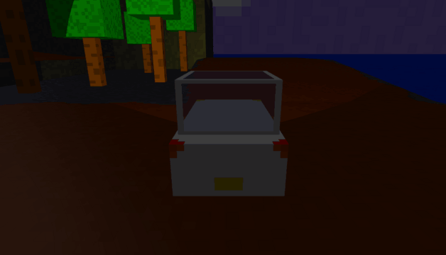

Racing Adventures
=================

[Play](https://racing-adventures.netlify.app/)
 | 
[Course Editor](https://racing-adventures.netlify.app/editor#c668c538c42893083208a108c67795073407b307c2478107a007c866c776c6562506c456c376c236c1460006c8759745c6252505c4157315a215c13560059844b744c6340504i404c3542214i10400142843i743c6436503c463c3332213j10340032842c752c6426512c422c34242029102b0020841c771c6616521c3318201b101c031884037407630b530c210c130c020)
